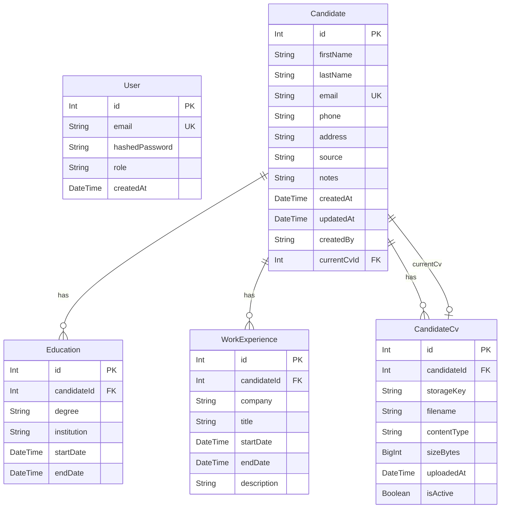

# Data Model Documentation

This document describes the current data model for the LTI ATS application, including entity descriptions, field definitions, relationships, and an entity-relationship diagram.

The authoritative source of truth is `backend/prisma/schema.prisma`. This document reflects the state after all applied migrations.

---

## Models

### 1. User

Represents an authenticated system user (e.g. a recruiter). Used for login and session management.

**Table:** `users`

| Field | Type | Constraints | Description |
|---|---|---|---|
| `id` | `Int` | PK, autoincrement | Unique identifier |
| `email` | `String` | Unique, max 255 | User's email address (login identifier) |
| `hashedPassword` | `String` | max 255 | Bcrypt hash (cost ≥ 12); never stored in plaintext |
| `role` | `String` | max 50 | User role (e.g. `recruiter`) |
| `createdAt` | `DateTime` | default `now()` | Record creation timestamp |

**Relationships:** none

---

### 2. Candidate

Represents a job candidate managed through the system.

**Table:** `candidates`

| Field | Type | Constraints | Description |
|---|---|---|---|
| `id` | `Int` | PK, autoincrement | Unique identifier |
| `firstName` | `String` | max 100, required | Candidate's first name |
| `lastName` | `String` | max 100, required | Candidate's last name; indexed |
| `email` | `String` | Unique, max 255, required | Candidate's email address |
| `phone` | `String?` | max 50 | Phone number (optional) |
| `address` | `String?` | max 255 | Address (optional) |
| `source` | `String?` | max 100 | Recruitment source e.g. LinkedIn (optional) |
| `notes` | `String?` | max 2000 | Recruiter notes (optional) |
| `createdAt` | `DateTime` | default `now()` | Record creation timestamp |
| `updatedAt` | `DateTime` | auto-updated | Last modification timestamp |
| `createdBy` | `String` | max 255, required | User ID of the recruiter who created the record |
| `currentCvId` | `Int?` | Unique FK → CandidateCv | Reference to the active CV (optional) |

**Relationships:**
- `educations` → one-to-many with `Education`
- `workExperiences` → one-to-many with `WorkExperience`
- `cvs` → one-to-many with `CandidateCv`
- `currentCv` → zero-or-one with `CandidateCv` (named relation `CurrentCv`)

---

### 3. Education

Represents one educational record associated with a candidate.

**Table:** `candidate_educations`

| Field | Type | Constraints | Description |
|---|---|---|---|
| `id` | `Int` | PK, autoincrement | Unique identifier |
| `candidateId` | `Int` | FK → Candidate (CASCADE) | Owning candidate; indexed |
| `degree` | `String?` | max 255 | Degree or qualification title (optional) |
| `institution` | `String?` | max 255 | Educational institution name (optional) |
| `startDate` | `DateTime?` | | Start of study period (optional) |
| `endDate` | `DateTime?` | | End of study period; null if ongoing (optional) |

**Relationships:**
- `candidate` → many-to-one with `Candidate` (deletes cascade)

---

### 4. WorkExperience

Represents one work experience record associated with a candidate.

**Table:** `candidate_work_experiences`

| Field | Type | Constraints | Description |
|---|---|---|---|
| `id` | `Int` | PK, autoincrement | Unique identifier |
| `candidateId` | `Int` | FK → Candidate (CASCADE) | Owning candidate; indexed |
| `company` | `String?` | max 255 | Company or organisation name (optional) |
| `title` | `String?` | max 255 | Job title / position (optional) |
| `startDate` | `DateTime?` | | Start of employment (optional) |
| `endDate` | `DateTime?` | | End of employment; null if current role (optional) |
| `description` | `String?` | max 2000 | Role description and responsibilities (optional) |

**Relationships:**
- `candidate` → many-to-one with `Candidate` (deletes cascade)

---

### 5. CandidateCv

Represents a CV file uploaded for a candidate. A candidate may have multiple CV versions; exactly one is designated active via `Candidate.currentCvId`.

**Table:** `candidate_cvs`

| Field | Type | Constraints | Description |
|---|---|---|---|
| `id` | `Int` | PK, autoincrement | Unique identifier |
| `candidateId` | `Int` | FK → Candidate (CASCADE) | Owning candidate; indexed |
| `storageKey` | `String` | max 500, required | File system path or storage key |
| `filename` | `String` | max 255, required | Original filename |
| `contentType` | `String` | max 100, required | MIME type (e.g. `application/pdf`) |
| `sizeBytes` | `BigInt` | CHECK ≥ 0 (DB-level) | File size in bytes |
| `uploadedAt` | `DateTime` | default `now()` | Upload timestamp |
| `isActive` | `Boolean` | default `true` | Whether this is the active CV version |

**Relationships:**
- `candidate` → many-to-one with `Candidate` (deletes cascade)
- `currentCvFor` → zero-or-one with `Candidate` (named relation `CurrentCv`)

**Supported formats:** PDF (`application/pdf`), DOCX (`application/vnd.openxmlformats-officedocument.wordprocessingml.document`)  
**Maximum size:** 5 MB (configurable via `CV_MAX_SIZE_BYTES` env var)

---

## Entity Relationship Diagram

---

## Key Design Principles

1. **Cascade deletes**: `Education`, `WorkExperience`, and `CandidateCv` records are removed automatically when their owning `Candidate` is deleted.
2. **Audit trail**: Every `Candidate` record tracks `createdAt`, `updatedAt`, and `createdBy` (the user ID of the recruiter who created it).
3. **CV versioning**: Multiple CV uploads are supported; the currently active CV is pointed to via `Candidate.currentCvId` to allow history without data loss.
4. **Security**: Passwords are stored exclusively as bcrypt hashes (cost ≥ 12). JWT secrets are environment variables and never appear in source code.
5. **Type safety**: All fields have explicit `@db.*` type annotations to match the actual PostgreSQL column types.
