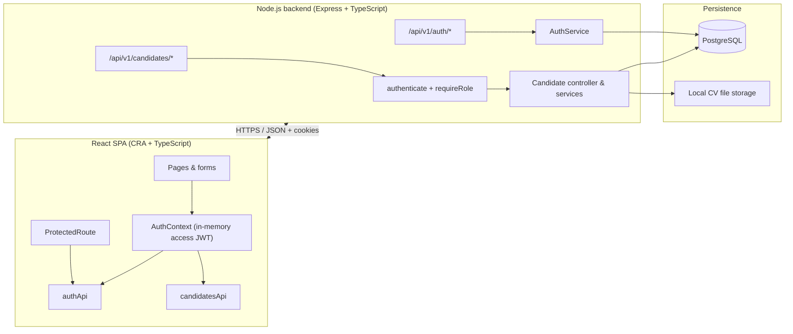
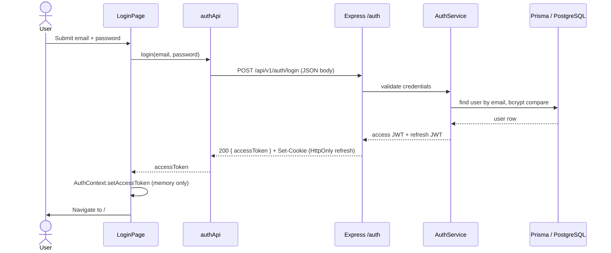
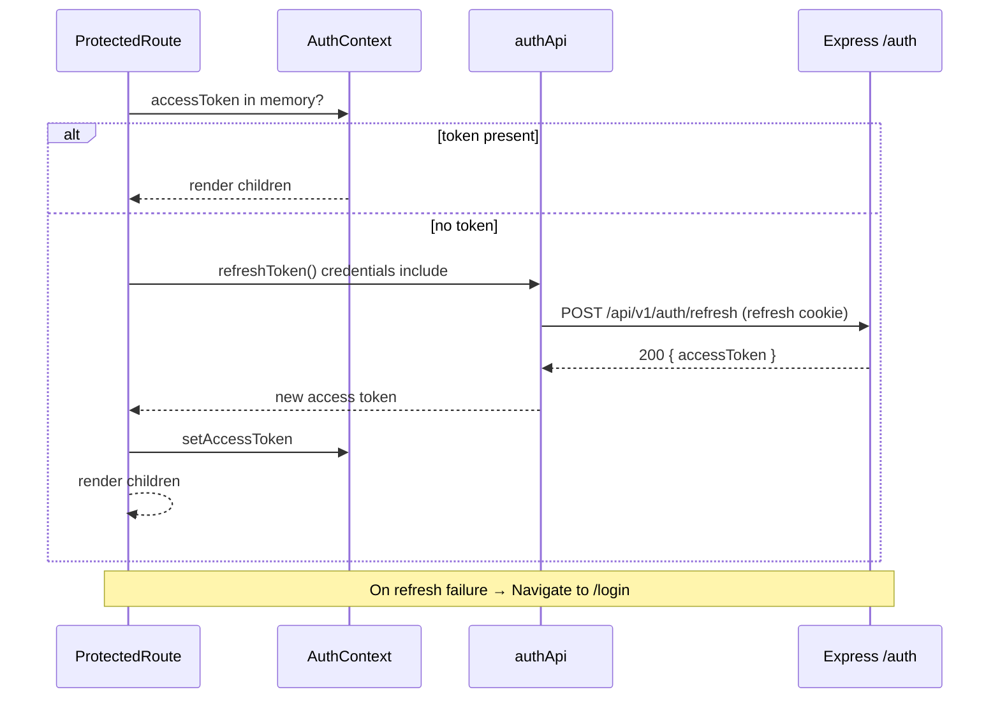
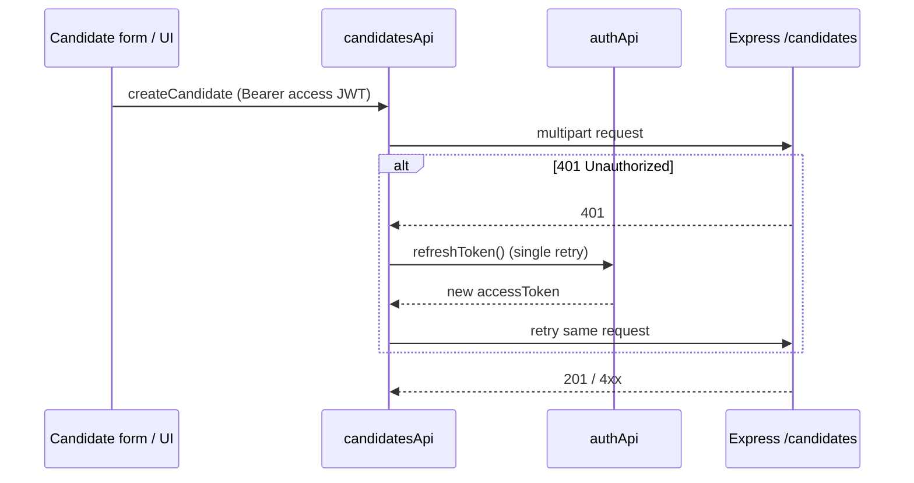

# Architecture & login flow (Mermaid)

## High-level system architecture

```mermaid
flowchart LR
  subgraph Client["React SPA (CRA + TypeScript)"]
    UI["Pages & forms"]
    AuthCtx["AuthContext (in-memory access JWT)"]
    AuthAPI["authApi"]
    CandAPI["candidatesApi"]
    Guard["ProtectedRoute"]
    UI --> AuthCtx
    AuthCtx --> AuthAPI
    AuthCtx --> CandAPI
    Guard --> AuthAPI
  end

  subgraph Server["Node.js backend (Express + TypeScript)"]
    MW["authenticate + requireRole"]
    AuthR["/api/v1/auth/*"]
    CandR["/api/v1/candidates/*"]
    AuthSvc["AuthService"]
    CandCtrl["Candidate controller & services"]
    AuthR --> AuthSvc
    CandR --> MW
    MW --> CandCtrl
  end

  subgraph Data["Persistence"]
    PG[(PostgreSQL)]
    FS["Local CV file storage"]
  end

  Client <-->|"HTTPS / JSON + cookies"| Server
  AuthSvc --> PG
  CandCtrl --> PG
  CandCtrl --> FS
```

## Login flow (sequence)

```mermaid
sequenceDiagram
  actor User
  participant LP as LoginPage
  participant AA as authApi
  participant API as Express /auth
  participant AS as AuthService
  participant DB as Prisma / PostgreSQL

  User->>LP: Submit email + password
  LP->>AA: login(email, password)
  AA->>API: POST /api/v1/auth/login (JSON body)
  API->>AS: validate credentials
  AS->>DB: find user by email, bcrypt compare
  DB-->>AS: user row
  AS-->>API: access JWT + refresh JWT
  API-->>AA: 200 { accessToken } + Set-Cookie (HttpOnly refresh)
  AA-->>LP: accessToken
  LP->>LP: AuthContext.setAccessToken (memory only)
  LP->>User: Navigate to /
```

## Protected route & silent refresh

```mermaid
sequenceDiagram
  participant PR as ProtectedRoute
  participant Ctx as AuthContext
  participant AA as authApi
  participant API as Express /auth

  PR->>Ctx: accessToken in memory?
  alt token present
    Ctx-->>PR: render children
  else no token
    PR->>AA: refreshToken() credentials include
    AA->>API: POST /api/v1/auth/refresh (refresh cookie)
    API-->>AA: 200 { accessToken }
    AA-->>PR: new access token
    PR->>Ctx: setAccessToken
    PR-->>PR: render children
  end
  Note over PR,API: On refresh failure → Navigate to /login
```

## API call with optional token refresh

```mermaid
sequenceDiagram
  participant CF as Candidate form / UI
  participant CA as candidatesApi
  participant AA as authApi
  participant API as Express /candidates

  CF->>CA: createCandidate (Bearer access JWT)
  CA->>API: multipart request
  alt 401 Unauthorized
    API-->>CA: 401
    CA->>AA: refreshToken() (single retry)
    AA-->>CA: new accessToken
    CA->>API: retry same request
  end
  API-->>CA: 201 / 4xx
```
