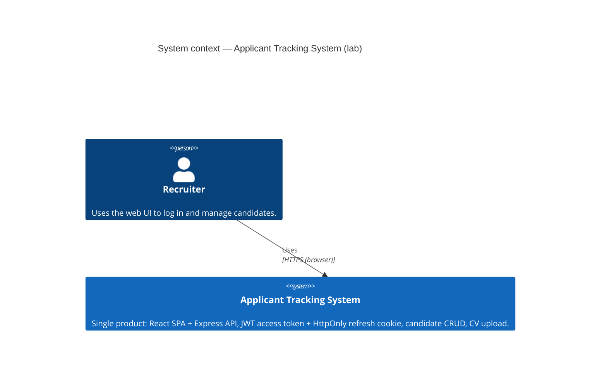
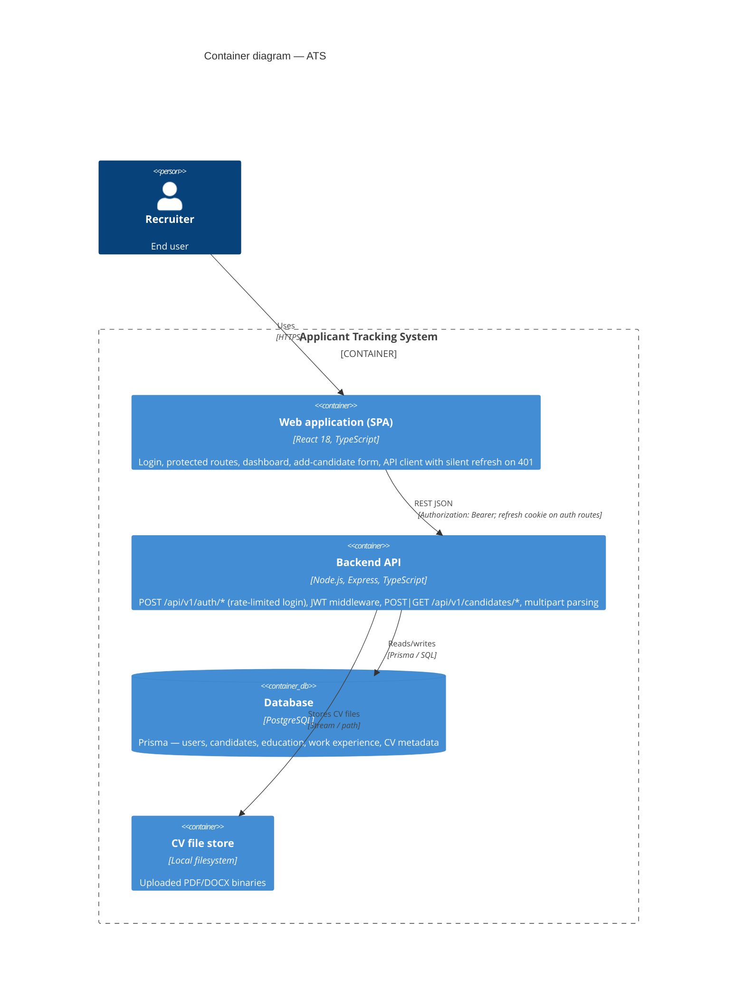

# 4. Architecture diagram (C4)

This document uses **C4 model** diagrams in Mermaid. If your viewer does not render `C4Context` / `C4Container`, paste the blocks into [Mermaid Live Editor](https://mermaid.live).

---

## C4 — System context

---

## C4 — Containers

